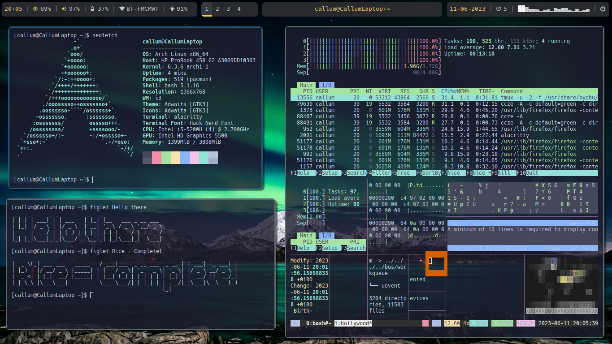

# Callum's Dotfiles

The files above, are my personal config files I use for my laptop on Arch Linux. If you have any questions then message me on my Discord : Callum#3333

# System Information

Below is the Current information for my system, I repurposed an old laptop I had:

 - **Laptop**: HP Probook 450 G2
 - **OS**: Arch Linux
 - **Window manager**: i3
 - **Theme**: Adwaita
 - **Icons**: Adwaita
 - **Terminal**: Alacritty
 - **Terminal Font**: Hack Nerd Font
 - **Application Launcher: Rofi**

## Install Script
At the present there is no Install script but In the future there will be one

# Screenshots
### Picture of desktop 
